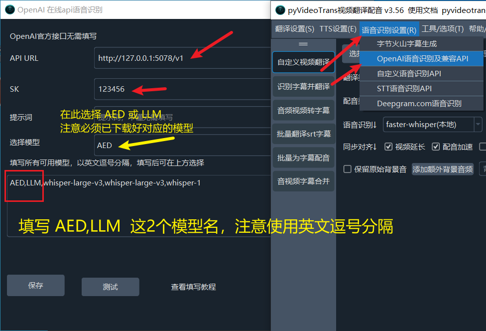

这是一个用于 [小红书ASR/FireRedASR](https://github.com/FireRedTeam/FireRedASR) 的webUI及API项目，api兼容openai格式


FireRedASR 是一个高度精确的中文语音转文字项目。

## WebUI


## 源码安装 Linux/MacOS

> 确保已安装 python3.10 、ffmpeg 
> 


进入某个目录下，打开终端

1. 拉取源码，执行命令 `git clone https://github.com/jianchang512/fireredasr-ui.git`
2. 进入源码目录 `cd FireRedASR`
3. 创建虚拟环境：`python3 -m venv venv` 
4. 激活该环境：`. venv/bin/activate`
5. 安装依赖:`pip3 install -r requirements.txt`
6. 下载AED模型，点击 [FireRedASR-AED-L模型下载](https://huggingface.co/FireRedTeam/FireRedASR-AED-L/tree/main)  下载模型，将页面中的几个文件下载后放入 `/pretrained_models/FireRedASR-AED-L`文件夹内
7. 下载LLM模型，点击 [FireRedASR-LLM-L模型下载](https://huggingface.co/FireRedTeam/FireRedASR-LLM-L/tree/main)  下载模型，将页面中的几个文件下载后放入 `/pretrained_models/FireRedASR-LLM-L`文件夹内
8. 下载 Qwen2-7B-Instruct 模型，点击 [Qwen2-7B-Instruct模型下载](https://huggingface.co/Qwen/Qwen2-7B-Instruct/tree/main) ，将页面中的几个文件下载后放入 `/pretrained_models/FireRedASR-LLM-L/Qwen2-7B-Instruct` 文件夹内

----

## Windows整合包

- AED模型(model.pth.tar)：体积 4.35G

- LLM模型：实际包含两个大模型，一个是小红书本身的识别模型(model.pth.tar) 3.37G，另外还包含`Qwen2-7B`的4个模型，合计 17G。

所有模型合计**21G**，即便压缩为7z，仍超过10G，集成到整合包中后，没有合适的网盘支持上传单文件大于10G的，因此整合包仅包含程序主体，不含任何模型，请下载整合包解压后，再按照下面说明单独下载模型，放入指定位置。

> 注意模型在 **huggingface.co** 网站上，这个网站国内无法访问，需要魔法才可下载。

### 整合包主体下载

整合包主体**247MB**, 较小，浏览器中打开该地址可直接下载

`https://github.com/jianchang512/fireredasr-ui/releases/download/v0.3/fireredASR-2025-0223.7z`
下载后解压，如下图


### 下载 AED 模型

这个比较简单，仅需要下载一个模型文件，然后将下载的  `model.pth.tar` 文件放到整合包目录的  `pretrained_models/FireRedASR-AED-L` 文件夹内即可

>下载地址:  
**https://huggingface.co/FireRedTeam/FireRedASR-AED-L/resolve/main/model.pth.tar?download=true**

下载后保存示例


### 下载 LLM 模型

这个略微复杂点，合计需要下载4个文件，1个是小红书本身的模型model.pth.tar，另3个是 Qwen2 的模型

* **model.pth.tar下载地址(小红书): ** 

*https://huggingface.co/FireRedTeam/FireRedASR-LLM-L/resolve/main/model.pth.tar?download=true*

将下载的  `model.pth.tar`  文件放到整合包的 `pretrained_models/FireRedASR-LLM-L` 文件夹内，注意文件夹名字中含有`LLM`，如下图，千万莫要搞错。


* **Qwen2模型下载地址:**

将以下4个链接下载的文件放到整合包的  `pretrained_models/FireRedASR-LLM-L/Qwen2-7B-Instruct` 文件夹内

*https://huggingface.co/Qwen/Qwen2-7B-Instruct/resolve/main/model-00001-of-00004.safetensors?download=true*

*https://huggingface.co/Qwen/Qwen2-7B-Instruct/resolve/main/model-00002-of-00004.safetensors?download=true*

*https://huggingface.co/Qwen/Qwen2-7B-Instruct/resolve/main/model-00003-of-00004.safetensors?download=true*

*https://huggingface.co/Qwen/Qwen2-7B-Instruct/resolve/main/model-00004-of-00004.safetensors?download=true*

下载后的4个文件放入 `Qwen2-7B-Instruct` 文件夹内，如下图。


### 启动整合包

模型下载并正确放置后，双击 `启动.bat` 即可执行启动，启动后会自动在浏览器中 `http://127.0.0.1:5078`，如果正确显示了如下界面，就可以使用了。


----

## API 地址:

默认地址: http://127.0.0.1:5078/v1


**OpenAI SDK中使用**

```
from openai import OpenAI
client = OpenAI(api_key='123456',
    base_url='http://127.0.0.1:5078/v1')

audio_file = open("5.wav", "rb")
transcript = client.audio.transcriptions.create(
  model="whisper-1",
  file=audio_file,
  response_format="json",
  timeout=86400
)

print(transcript.text)


```

## 在 pyVideoTrans 中使用

如下图在 `OpenAI语音识别及兼容API`中填写，然后在语音识别渠道中选择`OpenAI语音识别`




## Acknowledgements
- [小红书ASR/FireRedASR](https://github.com/FireRedTeam/FireRedASR) 